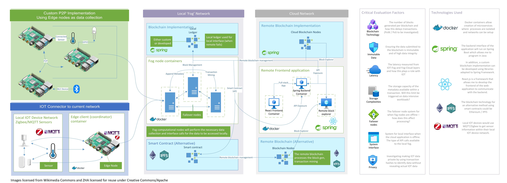

## Adopting the Internet of Things (IoT) with Blockchain
The aim of this project is to create a blockchain solution that aims to solve the maintainability, security, and privacy issues by using the blockchain infrastructure.

### Documentation

The following table shows the documentation available on this GitHub repository.

| Type           | Markdown Docs                                                | GitHub Project                                               |
| -------------- | ------------------------------------------------------------ | ------------------------------------------------------------ |
| System Design  | [IOT Blockchain - System Design.pdf](docs/assets/SystemDesign/IOT Blockchain - System Design.pdf) | ❌ (N/A)                                                      |
| Release Plan 1 | [releasePlan1.md](docs/assets/releasePlan1.md)               | [Release Plan 1](https://github.com/hkoci/BlockchainIOT/projects/2) |
| Release Plan 2 | 🚧 (WIP)                                                      | 🚧 (WIP)                                                      |

### Ethics

This project does not involve human participants and has been confirmed as No Ethics Required from BREO (*33991-NER-Dec/2021- 35483-1*)
