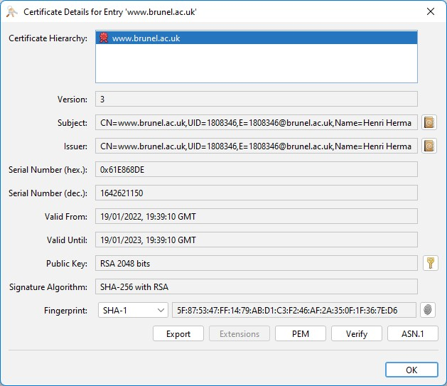

# Generated SSL Certificates

This folder contains generated SSL keystore certificates, these should be regenerated for release purposes. However, for this demonstration, the need of SSL is to prevent plaintext from being transmitted from the client and server.

### KeyStore details

The keystore password is: `Bl0ckCh41nI0T`

#### Certificate details

- Valid From: 19/01/2022, 19:39:10 GMT
- Valid Until: 19/01/2023, 19:39:10 GMT
- Public Key: RSA 2048 bits
- Signature Algorithm: SHA-256 with RSA
- Fingerprint: (SHA-1) 5F:87:53:47:FF:14:79:AB:D1:C3:F2:46:AF:2A:35:0F:1F:36:7E:D6

